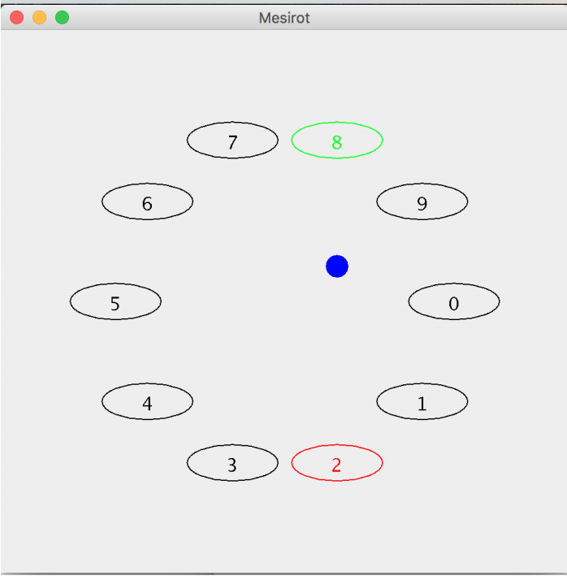

# Mesirot Game :large_blue_circle: 
The game consists of two or more participants and a ball. 
All the participants in the game stand in a circle and face the other participants. One of them holds the ball in his hand and must throw it to one of the other participants of his choice. The participant who received the ball passes it to another participant (or to the participant from whom he received the ball, depending on his choice) and so on. The person who fails to catch a thrown ball is eliminated from the game, and the person who remains last is declared the winner. 
The game starts with an initial number of players (the number is set in the constructor), one player is randomly selected to start passing the ball, and each time one player is randomly selected to pass the ball. 
The number of players is determined before the game starts, as well as the playing time. 

 

 

Each player runs on their own **__thread__** and is active for a set amount of time, which is determined when they are created. The player's activity time is a random variable determined by a lottery according to a normal distribution, which gives the mean and variance of the activity time. 
The mean and variance are parameters of the game that are set in the `Game` constructor. 
Also in the king of the game, more players are added to the game. The parameters that determine the arrival time of a new player are set in the `Game` constructor and are: the mean and variance of the arrival time of a new player. 
The difference between player arrival times is a random variable drawn according to a normal distribution when the mean and variance are given and constant throughout the game. 
Each player has a unique name. The name is a serial number based on the order of entry into the game. 
